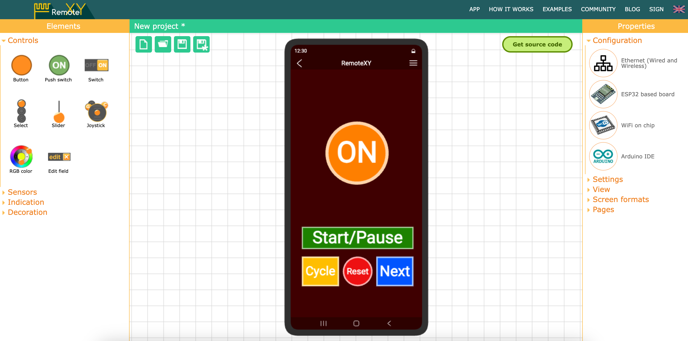
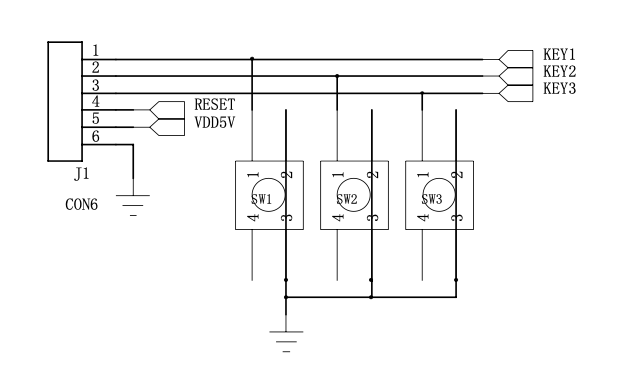
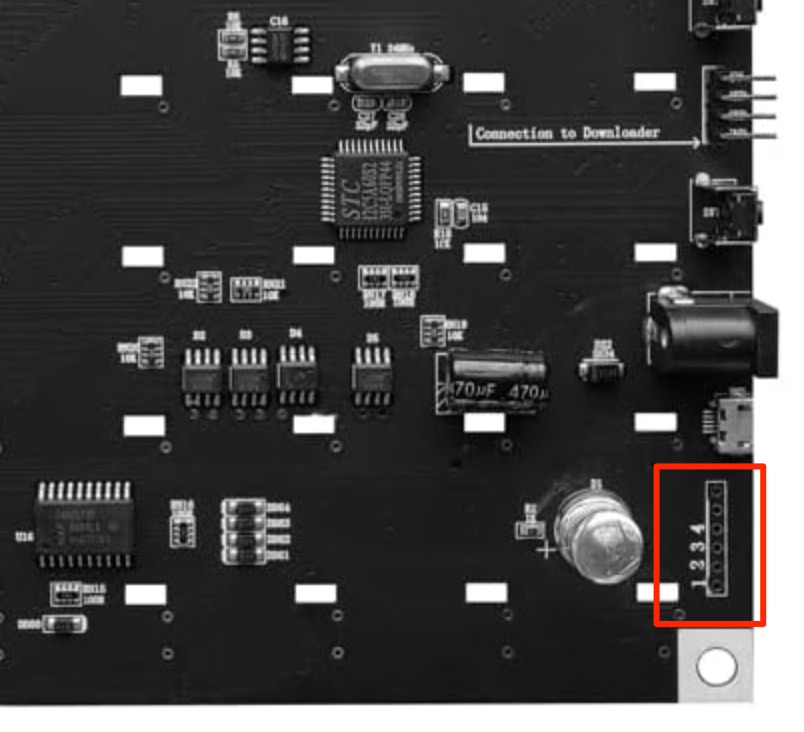
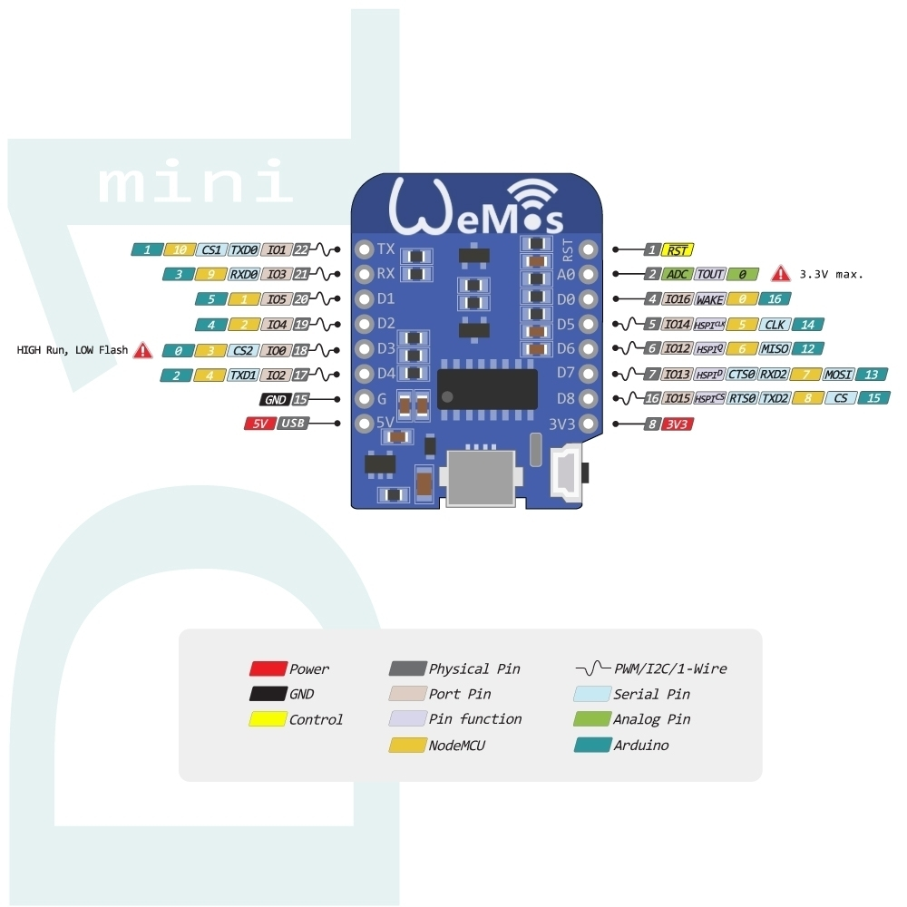

# iCubeSmart controlled by ESP8266

This project is designed to control the iCubeSmart 8x8x8 LED Cube using an ESP8266.

## Hardware

- iCubeSmart 3D8S 8x8x8 LED Cube: https://icubesmart.com/products/icubesmart-8x8x8-3d-led-cube-kit-diy-electronic-kits-teenagers-learning-soldering-project-kit-with-3d-editing-software-3d8p-?sku=18059416730476772687223687
- Wemos D1 Mini ESP8266 board: https://www.wemos.cc/en/latest/d1/d1_mini_3.1.0.html

## Software

- RemoteXY library:
  - https://remotexy.com/en/library/
  - https://github.com/RemoteXY/RemoteXY-Arduino-library
- Android app: https://remotexy.com/en/download/

The example of the RemoteXY project and how the App looks like:

## Usage

Please follow the instructions in the author's website: https://remotexy.com/en/help/

## Connection and Wiring

Here we can see original wiring of the iCubeSmart 8x8x8 LED Cube.
Schematic Diagram. It is also available in origin PDF:

How it looks like in real life on the board:

Wemos D1 Mini pinout:

Here we use the following pins:
 - `D1` (GPIO5) - Data In for START button (to the `first pin` of th cube)
 - `D2` (GPIO4) - Data In for CYCLE button (to the `second pin` of the cube)
 - `D3` (GPIO0) - Data In for NEXT button (to the `third pin` of the cube)
 - `D4` (GPIO2) - Data In for RESET button (to the `fourth pin` of the cube)
 - `GND` - Ground (to the `sixth pin` of the cube)
 - `5V` - Power (to the `fifth pin` of the cube)

## Configuration

Please use config.h file to customize pins and pass WIFI credentials.
The sample configuration is provided in the `config.h.sample` file.
